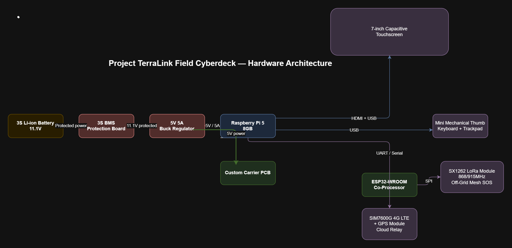
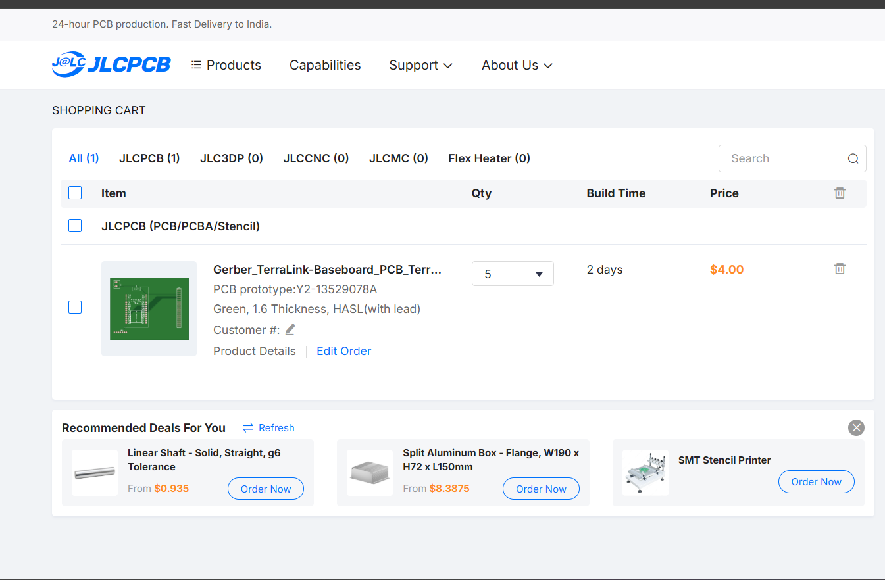

# Project TerraLink

TerraLink is an off-grid field terminal and communication baseboard designed to bridge a Raspberry Pi 5 with an ESP32 co-processor and an SX1262 LoRa module. It allows long-range mesh messaging, telemetry transfer, and offline field computing without cellular or internet connectivity.

## Hardware Features
- **Carrier Baseboard:** Custom 2-layer PCB designed in EasyEDA with dual-layer GND planes (0 DRC errors).
- **Communication Buses:** Dedicated hardware UART (Pi GPIO14/15 ⇄ ESP32 TX0/RX0) and high-speed SPI routing for SX1262 LoRa.
- **Power Delivery:** High-current 5V screw terminal input routed via wide traces to supply both boards cleanly.

## Design Previews

## Bill of Materials (BOM)
| Item | Part / Description | Qty | Estimated Cost |
| :--- | :--- | :--- | :--- |
| 1 | Custom TerraLink Carrier PCB (JLCPCB 5pcs) | 1 set | ~$15 |
| 2 | Raspberry Pi 5 (4GB) | 1 | ~$60 |
| 3 | SX1262 LoRa SPI Module (868/915MHz) | 1 | ~$12 |
| 4 | Terminal Blocks & 2.54mm Pin Headers | 1 set | ~$5 |
| 5 | Rugged 3D Printed Enclosure & Hardware | 1 | ~$10 |
| **Total** | | | **~$102** |

## Build Roadmap
- [x] Milestone 1: Schematic design, routing, and DRC validation (Complete)
- [ ] Milestone 2: Order fabrication through Hack Club grant
- [ ] Milestone 3: ESP32 packet framing & LoRa SPI bridge firmware
- [ ] Milestone 4: CAD Enclosure integration with 5"/7" DSI Capacitive Touch Display & Field UI
- [ ] Milestone 5: CAD enclosure modeling and assembly
- [ ] Milestone 6: Pi terminal UI & offline data testing

## Bill of custom PCB
.
## Creator

- Aryan Pandey (@Aryan on Hack Club Slack)
